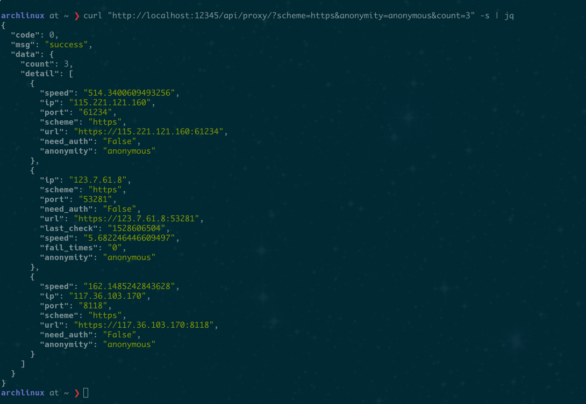

# fp-server

Free proxy server based on [Tornado](http://www.tornadoweb.org/en/stable/#) and [Scrapy](https://scrapy.org/).

Build your own proxy pool!

Features:
- continuesly crawling and providing free proxy
- with friendly and easy-to-use HTTP api
- asynchronous and high-perfermance
- support high con-concurrent
- automatically check proxy in cycle and ditch unavailable ones


免费代理服务器，基于[Tornado](http://www.tornadoweb.org/en/stable/#)和[Scrapy](https://scrapy.org/)，在本地搭建属于自己的代理池
- 持续爬取新的免费代理，检测可用后存入本地数据库
- 完全异步，支持高并发（从免费的前提下衡量……）
- 易用的HTTP API
- 周期性检测代理可用性，自动更新

[**查看中文文档\_(:ι」∠)\_**](./README_CN.md) 

This project has been tested on:
- Archlinux; Python-3.6.5
- Debian(WSL); Python-3.5.3

And it **cannot directly run on windows**. Windows users may try [using Docker](#using-docker) or WSL to run this project.

## Contents ##

<!-- vim-markdown-toc GFM -->

* [Get started](#get-started)
    * [Using Docker](#using-docker)
    * [Manually install](#manually-install)
* [web APIs](#web-apis)
    * [get proxies](#get-proxies)
    * [check status](#check-status)
* [Config](#config)
    * [Introduction](#introduction)
    * [Customization](#customization)
* [Source webs](#source-webs)
* [FAQ](#faq)
* [Bugs and feature requests](#bugs-and-feature-requests)
* [TODOs](#todos)

<!-- vim-markdown-toc -->

## Get started ##

Firstly you should have [Redis](https://redis.io/) installed. Then choose either one option as follows.
After successful deployment,  use the [APIs](#web-apis) to get proxies.

### Using Docker ###

The easiest way to run this repo is using [Docker](https://www.docker.com/). Install Docker then run:
```bash
# download the image
docker pull karmenzind/fp-server:stable
# run the container
docker run -itd --name fpserver --net="host" karmenzind/fp-server:stable
# check the output inside the container
docker logs -f fpserver
```
For custom configuratiuon, see [this section](#config).

### Manually install ###

1. Install `python>=3.5`(I use Python-3.6.5)
2. Clone this repo. 
3. Install python packages by: 
```bash
pip install -r requirements.txt
```
4. Read the [config](#config) and modify it according to your need.
5. Start the server:
```bash
python ./src/main.py
```

## web APIs ##

typical response:
```json
{
    "code": 0,
    "msg": "ok",
    "data": {}
}
```

-   code: result of event (not http code), 0 for sucess
-   msg: message for event
-   data: detail for sucessful event

### get proxies ###

```
GET /api/proxy/
``` 

 params                 | Must/<br>Optional | detail                                                               | default
------------------------|-------------------|----------------------------------------------------------------------|---------|
 count                  | O                 | the number of proxies you need                                       | 1
 scheme                 | O                 | choices:`HTTP` `HTTPS`                                               | both*
anonymity               | O                 | choices:`transparent` `anonymous`                                    | both
(TODO)<br>sort_by_speed | O                 | choices:<br>1: desending order<br>0: no order<br>-1: ascending order | 0

- both: include all type, not grouped

**example**

-   To acquire 10 proxies in HTTP scheme with anonymity:
    ```
    GET /api/proxy/?num=10&scheme=HTTP&anonymity=anonymous
    ```
    The response:
    ```json
    {
        "code": 0,
        "msg": "ok",
        "data": {
            "count": 9,
            "items": [
            {
                "port": 2000,
                "ip": "xxx.xxx.xx.xxx",
                "scheme": "HTTP",
                "url": "http://xxx.xxx.xxx.xx:xxxx",
                "anonymity": "transparent"
            }
            ]
        }
    }
    ```

**screenshot**



### check status ###

Check server status. Include:
-   Running spiders
-   Stored proxies

```
GET /api/status/
```

No params.

**screenshot**


## Config ##

### Introduction ###
I choose YAML language for configuration file. The defination and default value for supported items are:

```yaml
# server's http port
HTTP_PORT: 12345

# redirect output to console other than log file
CONSOLE_OUTPUT: 1

# Log
# dir and filename requires `CONSOLE_OUTPUT: 0`
LOG: 
  level: 'debug'
  dir: './logs'
  filename: 'fp-server.log'

# redis database
REDIS:
  host: '127.0.0.1'
  port: 6379
  db: 0

# stop crawling new proxies
# after stored this many proxies
PROXY_STORE_NUM: 500

# Check availability in cycle
# It's for each single proxy, not the checker
PROXY_STORE_CHECK_SEC: 3600
```

### Customization ###

- If you use Docker:
    - Create a directory such as `/x/config_dir` and put your `config.yml` in it. Then modify the docker-run command like this:
        ```
        docker run -itd --name fpserver --net="host" -v "/x/config_dir":"/fps-config" karmenzind/fp-server:stable
        ```
    - External `config.yml` doesn't need to contain all config items. For example, it can be:
        ```
        PROXY_STORE_NUM: 100
        LOG:
            level: 'info'
        PROXY_STORE_CHECK_SEC: 7200
        ```
        And other items will be default values.
    - If you need to set a log file, **don't** modify `LOG-dir` in `config.yml`. Instead create a directory for log file such as `/x/log_dir` and change the docker-run command like:
        ```
        docker run -itd --name fpserver --net="host" -v "/x/config_dir":"/fps_config" -v "/x/log_dir":"/fp_server/logs" karmenzind/fp-server:stable
        ```
- If you manually deploy the project:
    - Modify the internal config file: `src/config/common.py`

## Source webs ##

Growing……

If you knew good free-proxy websites, please tell me and I will add them to this project.

Supporting:
- [x] [西刺代理](http://www.xicidaili.com)
- [x] [快代理](http://www.kuaidaili.com)
- [x] [云代理](http://www.ip3366.net) (partial)
- [ ] [小幻代理](https://ip.ihuan.me) (figuring)
- [ ] [万能代理](http://wndaili.cn)
- [ ] [89免费代理](http://www.89ip.cn/)
- [ ] [66免费代理](http://www.66ip.cn/)

## FAQ ##

-   How about the availability and quality of the proxies?
    Before storing new proxy, fp-server will check its availability, anonymity and speed based on your local network. So, feel free to use the crawled proxies.
-   How many `PROXY_STORE_NUM` should I set? Is there any limitation?
    You should set it depends on your real requirement. If your project is a normal spider, then 300-500 will be fair enough. I haven't set any limitation for now. After stored 10000 available proxies, I stopped testing. The upper limit is relevant to source websites. I will add more websites if more people use this project.
-   How to use it in my project?
    I'm gonna write some snippets, which can be directly copied to your project, for several popular frameworks. So if you can wait for me……

## Bugs and feature requests ##

I need your feedback to make it better.<br>
Please [create an issue](https://github.com/Karmenzind/fp-server/issues/new) for any problems or advice.

Known bugs:
*   Many wierd `None`…… thought because of insecure thread
*   Block while using Tornado-4.5.3

## TODOs ##

*   Divide log module
*   More detailed api
*   Web frontend via bootstrap
*   Add user-agent pool

